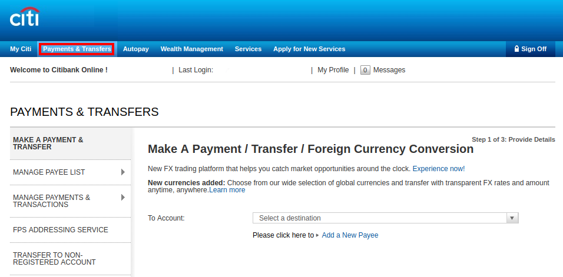
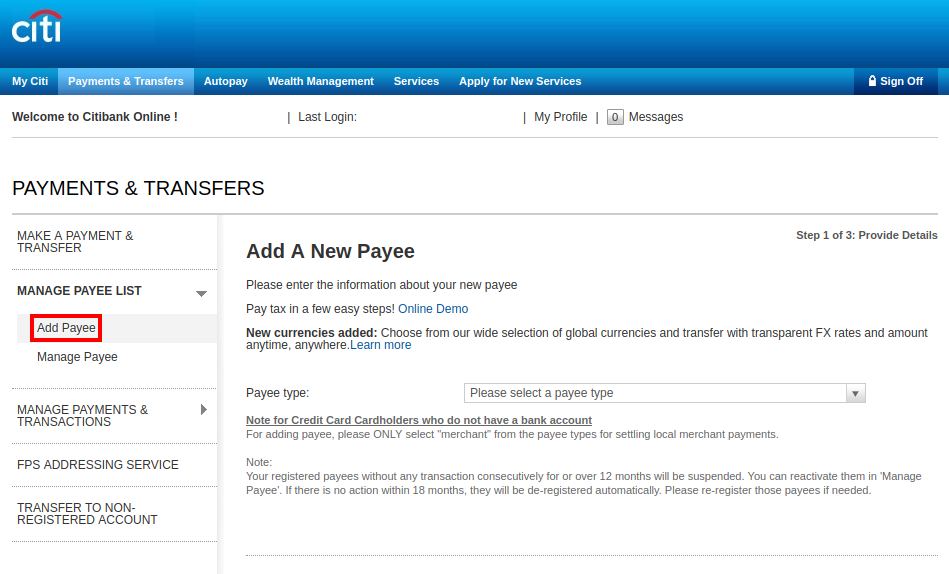
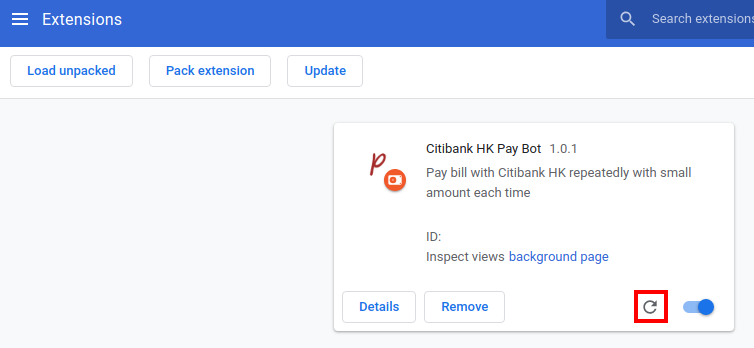

# Citibank HK Pay Bot

## Description

Pay bill via Citibank HK with small amount repeatedly.

The extension uses native JavaScript without any third party libraries.

The extension will simulate user actions, e.g. filling form, clicking buttons.
And it will complete the pay process automatically.

## Installation

Only manually install the extension is supported currently:

### Manual Install

- Download the ZIP file: <https://github.com/freelancer2047/chrome-cibibankhk-pay-bot/releases>
- Unzip the ZIP file
- Go to `chrome://extensions` and turn on Developer mode at the top right corner
- Click the Load unpacked extension button and select the unzipped folder, the folder should contain `manifest.json` file
- The extension is installed

*Old versions can be find here: <https://github.com/freelancer2047/chrome-citibankhk-pay-bot/releases>*

## Usage

> The extension will only work on Citibank HK domain.

- Login Citibank HK Online Banking  (<https://www.citibank.com.hk/HKGCB/JSO/signon/DisplayUsernameSignon.do>)
- Navigate to Payments & Transfers page (need OTP verification)

- Note that you will need to register the payee in MANAGE PAYEE LIST page first

- Click on the extension icon next to address bar to open the popup
- Fill in the form
- Enter a part of the To Account name of the target payee (e.g. last 4 digit of tax shroff account)
- Enter a part of the From Account name of the account you wish to pay from (e.g. last 4 digit of credit card account)
- Enter the min and max amount to pay
- Note that Citibank HK will ban payments that are too similar so please allow min and max to differ by at least 0.15
- Click Run
- Progress will be displayed in the popup

> Whenever error occurs, please click the Stop button. If the Run button remain disabled after clicking Stop button, please reload the extension to restart the bot.

## FAQ

Does the extension work on Chinese or English Citibank HK Online Banking website?
> It is verified to work on English language website only. The author haven't tried to use it on Chinese language website but it may as well work.

Can I leave the tab in background?
> Better keep the tab active. It is okay for a short period of time, but for a longer time, Chrome may do performance throttling on background tabs, which would lead to unknown behaviour.

## Remark

The extension may no longer work if Citibank HK updates the website.

## Acknowledgements

Modified from [chrome-ppshk-pay-bot](https://github.com/freehk-developer/chrome-ppshk-pay-bot)
